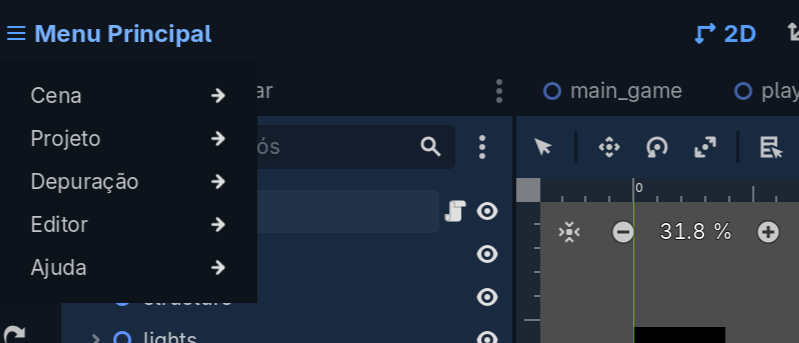
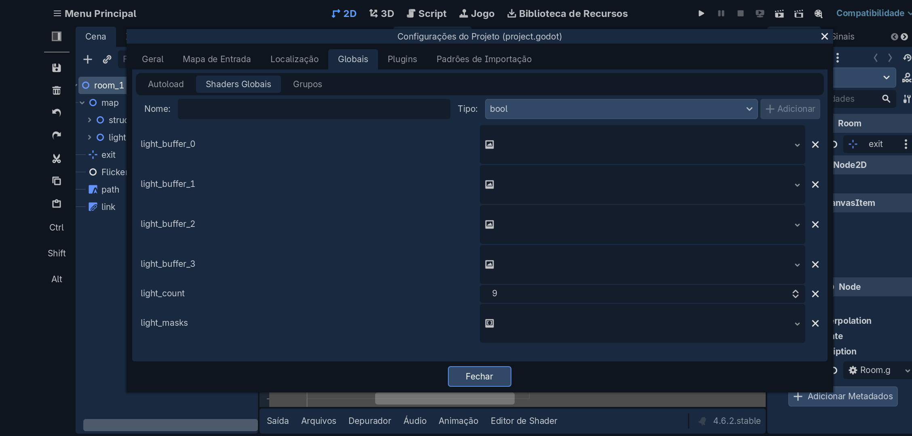

# News v0.0.3
- Agora as luzes serão ocultadas caso o pai esteja invisível.

English:
- Now the lights will be hidden if the parent is invisible.

# FakePointLight2D-For-Godot-4
Um recurso que fiz para os meus projetos mas agora adaptado para qualquer um usar! FakePointLight2D simula uma luz perfeitamente leve e convincente, perfeito para hardwares mais fracos como dispositivos móveis.

Adiciona um novo node chamado "FakePointLight2D" que quando instanciado irá simular uma iluminação nos objetos 2D envolta, por fazer um simples calculo de projeção de textura a luz é super leve, não calcula reflexões, não calcula normalmaps e nem calcula distância, apenas calcula a posição e a projeção de textura. O melhor de tudo é que o cálculo é feito 100% na Placa de Vídeo (GPU), a CPU (GDscript) é apenas responsável por transferir parâmetros para a sua GPU como cor, intensidade, máscara de luz, posição, escala e rotação.

Como usar?:

Ainda está em fase experimental mas já pode ser usado em seus projetos sem medo, somente a instalação que pode ser bem chato, mas não é nada complicado.

1. Configure o "LightManager.gd" como singleton em seu projeto.

2. Certifique que não há erros de referência ou caminho inválido.

3. Após checar tudo recomendo que reinicie o seu projeto (não é necessário reiniciar a engine).

5. Depois de reiniciar você deve carregar o shader "dynamic_fake_light.res" nos objetos que você quer que o FakePointLight2D ilumine. Dica: você pode carregar em um Node2D e fazer seus filhos herdarem seu material, assim você tera uma iluminação mais global. Obs: Você deve declarar uniformes globais para o shader funcionar. recomendo que leia a nota ("note.txt") para entender melhor mas aqui vai uma breve explicação:

Vá em Projects -> Project Settings -> Globals -> Global Shaders

Depois declare os parâmetros globais:

4. E por fim instancie o FakePointLight2D em sua cena 2D através do ícone de "+" (você não precisa anexar o script "point_light.gd" em um Node2D).

⚠️ Termos e Condições ⚠️:

Você pode alterar/modificar, distribuir e fazer melhorias, mas seria muito legal da sua parte dá os devidos créditos a mim (GreenDevGDStudios), mas você pode usar a vontade em seus projetos :D

Também deixei um shader de brinde para melhorar ainda mais a iluminação de sua cena :).

---

# English Description:

A feature I originally created for my own projects, now adapted for anyone to use! FakePointLight2D simulates a lightweight and convincing light, perfect for weaker hardware such as mobile devices.

It adds a new node called "FakePointLight2D" which, when instantiated, simulates lighting on surrounding 2D objects. By performing a simple texture projection calculation, the light remains extremely lightweight. It does not calculate reflections, normal maps, or distance—only position and texture projection.

Best of all, the calculation is done 100% on the graphics card (GPU). The CPU (GDScript) is only responsible for sending parameters to the GPU, such as color, intensity, light mask, position, scale, and rotation.

How to use:

It is still in an experimental stage, but it can already be safely used in your projects. The installation process can be a bit tedious, but it’s not complicated.

1. Set up "LightManager.gd" as a singleton in your project.

2. Make sure there are no reference errors or invalid paths.

3. After checking everything, it is recommended to restart your project (you do not need to restart the engine).

4. After restarting, you should load the shader "dynamic_fake_light.res" into the objects you want FakePointLight2D to illuminate. Tip: you can load it into a Node2D and let its children inherit the material, giving you more global lighting.

5. Finally, instance FakePointLight2D into your 2D scene using the "+" icon (you do not need to attach the script "point_light.gd" to a Node2D).

⚠️ Terms and Conditions ⚠️:

You are free to modify, distribute, and improve it, but it would be greatly appreciated if you gave proper credit to me (GreenDevGDStudios). That said, feel free to use it in your projects :D

I also included a bonus shader to further enhance your scene’s lighting :)
